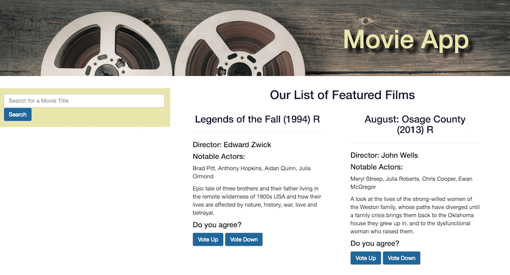

# Favorite Movies App
## Angular Build Project
Misha LeClair



## Objectives
* Build an app with Angular

I set several goals for this project and in many ways it became an exercise in changing course. This was my first time incorporating all the Angular lessons and labs in one place on an individual project, including more modular code with controllers, services, and directives.

* Use an external API - accomplished!

I have struggled with external APIs in past lessons and labs, so I made this a top priority. I wanted to solidify best practices for tapping into external APIs and accomplish this personal goal.

* Explore a new styling framework

I have solely used Bootstrap to compliment my CSS and was interested in exploring a new framework this time around. I picked Material Design Lite. I got the grids working but when I wanted to add a search bar, I quickly figured out MDL was really restrictive. After awhile, I decided to take out MDL and revert back to Bootstrap.

* Add a vote up or vote down feature

After I got the API working, I wanted to display a list of selected movies and let users vote up or vote down. I realized this would require some server side work and started mocking that up. The idea was to deploy a small server side, and get the vote data from it like a second API call. After awhile I realized I didn't have to the time to build it and get it work. So after awhile I took this out as well.

## Links

GitHub Repository: https://github.com/sfnewzgirl/angular-build-favorite-movies

## Technologies Used
* HTML, CSS, JavaScript, Angular
* The Open Movie Database API (http://www.omdbapi.com/)
* Material Design Lite (taken out)
* Bootstrap
* Mongoose, Express, Node.js (taken out)

## Code Examples

This was my first time using an Angular service or promise.

```
angular.module('moviesApp')
        .service('MovieService', MovieService);

MovieService.$inject = ['$http', '$q'];
function MovieService($http, $q) {
  console.log('entered movieservice');
  var self = this;
  self.movie = {}; //one movie object
  self.get = get; //get one movie

  //call to show one movie
  function get(id) {
    console.log('one movie request', id);
    //create a deferred
    var deferred = $q.defer();

    $http({
      method: 'GET',
      url: 'http://www.omdbapi.com/?t=' + id + '&plot=short&r=json'
    }).then(oneMovieSuccess, onError);

    //return promise
    return deferred.promise;

    //resolve
    function oneMovieSuccess(response) {
      console.log('one movie came back', response);
      self.movie = response.data;
      //get data from db
      //function to add to movie data
      deferred.resolve(self.movie);
    }
    //reject
    function onError(response) {
      console.log('something went wrong with one movie', response);
      self.movie = {error: error};
      deferred.reject(self.movie);
    }
  }
}

```
A user can click on the vote up or vote down button and see a corresponding arrow appear to confirm their vote.

```
<h4>Do you agree?</h4>
<button ng-model="upVotes" ng-click="upVote = true; downVote = !true" class="btn btn-default">Vote Up</button>
<button ng-model="downVotes" ng-click="downVote = true; upVote = !true" class="btn btn-default">Vote Down</button>
<button ng-show="upVote" class="btn btn-default glyphicon glyphicon-upload"></button>
<button ng-show="downVote" class="btn btn-default glyphicon glyphicon-download"></button>
```

## Future Ideas
* Build a server side API to serve up a persistent vote count for up and down votes.
